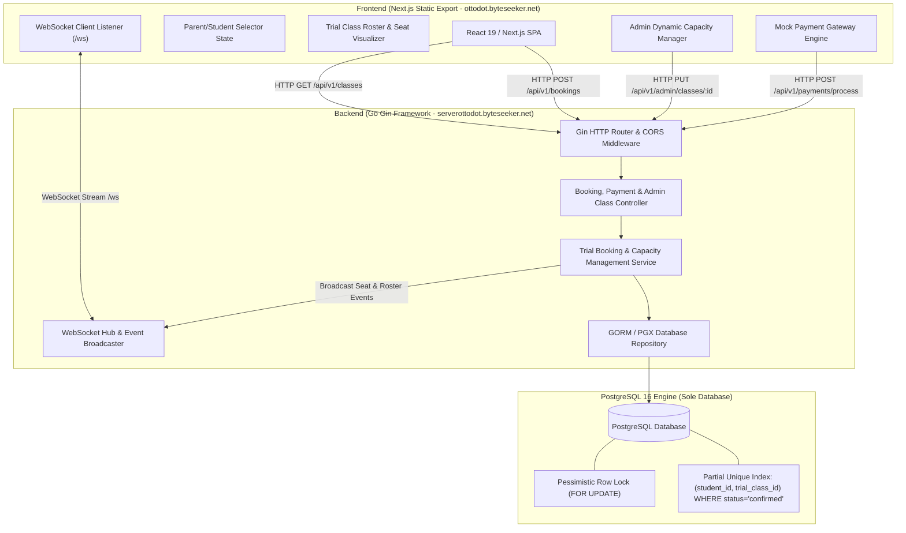

# System Architecture & Technical Design Document
## Ottodot Trial Booking & Concurrency Engine

| Field | Description |
| :--- | :--- |
| **System** | Ottodot High-Reliability Trial Booking Engine |
| **Frontend Domain** | `https://ottodot.byteseeker.net` (Next.js Static Export Client) |
| **Backend Domain** | `https://serverottodot.byteseeker.net` (Go Gin REST Server) |
| **Database** | PostgreSQL 16+ (Sole Database Engine, MongoDB Removed) |
| **Software Principles** | SRP, DRY, Clean Architecture, Zero Hardcoding, Dynamic Capacity |
| **Author** | Senior Full-Stack Engineer |

---

## 1. System Architecture Diagram

The system operates as a client-side rendered Single Page Application (SPA) built with Next.js static export, interacting with a high-performance Go Gin backend server backed by PostgreSQL.



---

## 2. Technical Stack Specifications & SE Principles

### 2.1 Software Engineering Core Principles
1. **Single Responsibility Principle (SRP)**:
   - `Controllers`: Handle HTTP request parsing, payload validation, and HTTP responses.
   - `Services`: Contain domain business logic, race condition resolution algorithms, and transaction boundaries.
   - `Repositories`: Handle SQL persistence, pessimistic row locking (`SELECT ... FOR UPDATE`), and query execution.
   - `WebSocket Hub`: Manages client connections and event broadcasting independently.
2. **Don't Repeat Yourself (DRY)**:
   - Unified API response formatter `utils.ResponseSuccess` and `utils.ResponseError`.
   - Shared SQL transaction helper for execution safety.
3. **Zero Hardcoding**:
   - Class capacity limit (`capacity`) is stored in the database per class (`trial_classes.capacity`), default 4, editable by Admin via API.
   - Timeout durations, port configurations, and CORS origins loaded dynamically from environment variables.
4. **Single Unified Persistence**:
   - **PostgreSQL 16+** is used as the sole database engine. MongoDB has been completely removed to maintain transactional consistency and simplify operational overhead.

### 2.2 Frontend Framework & Build Strategy
- **Framework**: Next.js 15+ (React 19, TypeScript, TailwindCSS).
- **Export Strategy**: Static HTML/JS Export (`output: 'export'` in `next.config.ts`).
- **State & Data Fetching**: React Hooks + Custom API Client with WebSocket live updates.
- **Styling & Aesthetics**: Modern UI/UX Pro Max standards, dark/light contrast, `rounded-sm` geometric accents, custom micro-interactions.

### 2.3 Backend Server
- **Language**: Go 1.25.x.
- **Web Framework**: Gin Web Framework (`github.com/gin-gonic/gin`).
- **ORM & Driver**: GORM (`gorm.io/gorm`) with `gorm.io/driver/postgres` and `pgx/v5`.
- **Logger**: Zap Logger (`go.uber.org/zap`).
- **Concurrency Control**: PostgreSQL transactions with explicit pessimistic row locks (`SELECT ... FOR UPDATE`).

---

## 3. Database Schema & Data Modeling

### 3.1 ER Diagram (Pure PostgreSQL Schema)

```mermaid
erdiagram
    PARENTS ||--|{ STUDENTS : "has"
    STUDENTS ||--o{ BOOKINGS : "makes"
    TRIAL_CLASSES ||--o{ BOOKINGS : "contains"
    BOOKINGS ||--o{ PAYMENT_ATTEMPTS : "triggers"

    PARENTS {
        uuid id PK
        string name
        string email
        timestamp created_at
    }

    STUDENTS {
        uuid id PK
        uuid parent_id FK
        string name
        int age
        timestamp created_at
    }

    TRIAL_CLASSES {
        uuid id PK
        string title
        string subject
        timestamp start_time
        int capacity "Configurable per class (Default 4)"
        int enrolled_count
        timestamp created_at
        timestamp updated_at
    }

    BOOKINGS {
        uuid id PK
        uuid student_id FK
        uuid trial_class_id FK
        string status "pending_payment | confirmed | payment_failed | cancelled | expired"
        string payment_token
        timestamp created_at
        timestamp updated_at
    }

    PAYMENT_ATTEMPTS {
        uuid id PK
        uuid booking_id FK
        numeric amount
        string status "pending | succeeded | failed"
        string failure_reason
        timestamp created_at
    }
```

### 3.2 SQL DDL Definition

```sql
-- PostgreSQL DDL Setup (Sole Database Engine)

CREATE TABLE parents (
    id UUID PRIMARY KEY DEFAULT gen_random_uuid(),
    name VARCHAR(255) NOT NULL,
    email VARCHAR(255) UNIQUE NOT NULL,
    phone VARCHAR(50),
    created_at TIMESTAMPTZ DEFAULT CURRENT_TIMESTAMP
);

CREATE TABLE students (
    id UUID PRIMARY KEY DEFAULT gen_random_uuid(),
    parent_id UUID NOT NULL REFERENCES parents(id) ON DELETE CASCADE,
    name VARCHAR(255) NOT NULL,
    age INT NOT NULL,
    created_at TIMESTAMPTZ DEFAULT CURRENT_TIMESTAMP
);

CREATE TABLE trial_classes (
    id UUID PRIMARY KEY DEFAULT gen_random_uuid(),
    title VARCHAR(255) NOT NULL,
    subject VARCHAR(50) NOT NULL CHECK (subject IN ('Science', 'Math', 'Coding')),
    start_time TIMESTAMPTZ NOT NULL,
    capacity INT NOT NULL DEFAULT 4 CHECK (capacity > 0),
    enrolled_count INT NOT NULL DEFAULT 0 CHECK (enrolled_count >= 0),
    created_at TIMESTAMPTZ DEFAULT CURRENT_TIMESTAMP,
    updated_at TIMESTAMPTZ DEFAULT CURRENT_TIMESTAMP
);

CREATE TABLE bookings (
    id UUID PRIMARY KEY DEFAULT gen_random_uuid(),
    student_id UUID NOT NULL REFERENCES students(id) ON DELETE RESTRICT,
    trial_class_id UUID NOT NULL REFERENCES trial_classes(id) ON DELETE RESTRICT,
    status VARCHAR(50) NOT NULL CHECK (status IN ('pending_payment', 'confirmed', 'payment_failed', 'cancelled', 'expired')),
    payment_token VARCHAR(255) UNIQUE NOT NULL,
    created_at TIMESTAMPTZ DEFAULT CURRENT_TIMESTAMP,
    updated_at TIMESTAMPTZ DEFAULT CURRENT_TIMESTAMP
);

CREATE TABLE payment_attempts (
    id UUID PRIMARY KEY DEFAULT gen_random_uuid(),
    booking_id UUID NOT NULL REFERENCES bookings(id) ON DELETE CASCADE,
    amount NUMERIC(10, 2) NOT NULL DEFAULT 0.00,
    status VARCHAR(50) NOT NULL CHECK (status IN ('pending', 'succeeded', 'failed')),
    failure_reason TEXT,
    created_at TIMESTAMPTZ DEFAULT CURRENT_TIMESTAMP
);

-- CRITICAL INDEXES FOR RACE CONDITION & DUPLICATE PREVENTION

-- 1. Partial Unique Index: Prevent duplicate confirmed bookings for the same child in the same class
CREATE UNIQUE INDEX idx_unique_confirmed_booking 
ON bookings (student_id, trial_class_id) 
WHERE status = 'confirmed';

-- 2. Fast lookup index for active class rosters
CREATE INDEX idx_bookings_class_status ON bookings (trial_class_id, status);
```

---

## 4. Concurrency & Dynamic Capacity Resolution Protocol

### 4.1 Transaction Execution Protocol

When a parent submits payment confirmation:
1. Backend opens PostgreSQL transaction.
2. Acquires row lock: `SELECT id, capacity, enrolled_count FROM trial_classes WHERE id = $1 FOR UPDATE`.
3. Reads the class's **dynamic capacity** (`capacity`) directly from the locked DB row.
4. Executes SQL count: `SELECT COUNT(*) FROM bookings WHERE trial_class_id = $1 AND status = 'confirmed'`.
5. If `confirmed_count < capacity`:
   - Status updated to `confirmed`.
   - `enrolled_count` incremented.
   - Payment record saved as `succeeded`.
   - Transaction Committed.
   - WebSocket broadcasts updated seat count to all clients.
6. If `confirmed_count >= capacity`:
   - Status updated to `payment_failed` (`CLASS_FULL_RACE_LOST`).
   - Payment record saved as `failed`.
   - Transaction Committed.
   - Returns HTTP 409 Conflict.

---

## 5. API Endpoint Specifications

Base URL: `https://serverottodot.byteseeker.net/api/v1`

### 5.1 `GET /api/v1/classes`
Returns all active trial classes with calculated dynamic remaining seats.

### 5.2 `POST /api/v1/bookings`
Creates a pending booking for a child and trial class.

### 5.3 `POST /api/v1/payments/process`
Executes mock payment and resolves seat reservation atomically based on class dynamic capacity.

### 5.4 `PUT /api/v1/admin/classes/:id` (Dynamic Capacity Management)
Updates class properties and max student capacity dynamically.

**Request Body**:
```json
{
  "title": "Fun with Chemical Reactions - Advanced",
  "subject": "Science",
  "start_time": "2026-10-01T10:00:00Z",
  "capacity": 6
}
```

**Response `200 OK`**:
```json
{
  "success": true,
  "data": {
    "id": "a0eebc99-9c0b-4ef8-bb6d-6bb9bd380a11",
    "title": "Fun with Chemical Reactions - Advanced",
    "subject": "Science",
    "start_time": "2026-10-01T10:00:00Z",
    "capacity": 6,
    "enrolled_count": 3,
    "remaining_seats": 3
  }
}
```

### 5.5 `GET /api/v1/admin/classes/:id/roster`
Returns roster of confirmed students for a specific class.

### 5.6 `WS /ws` (WebSocket Real-Time Broadcast)
WebSocket endpoint for real-time seat availability updates and roster changes.
